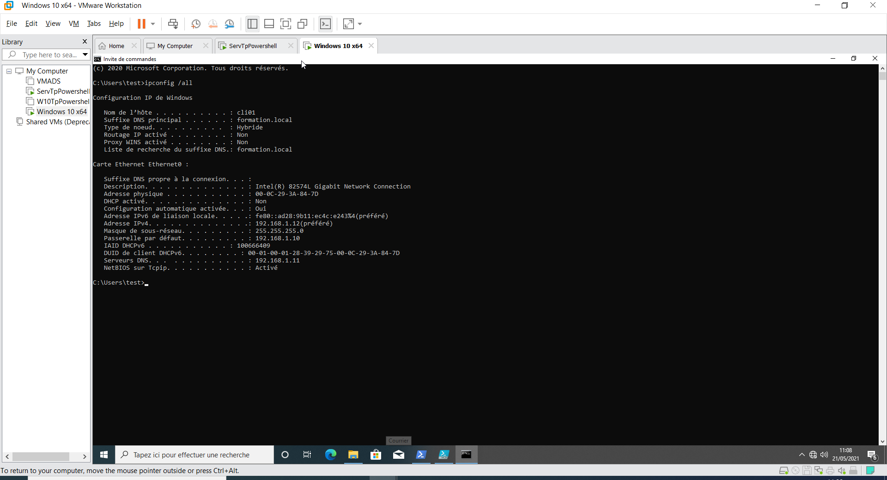
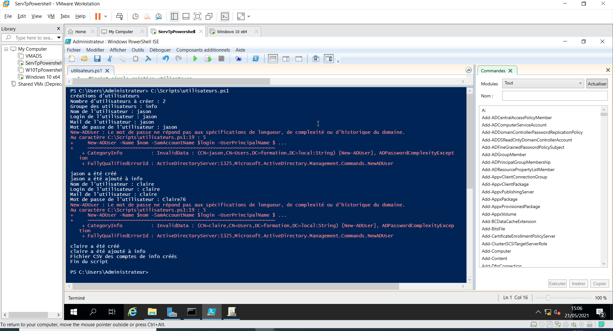
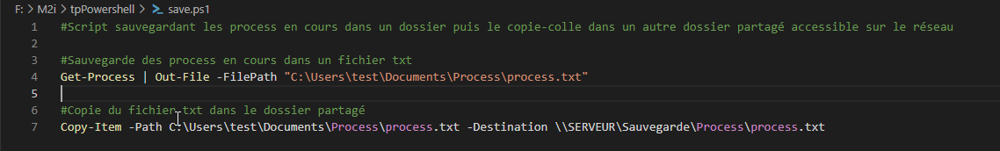
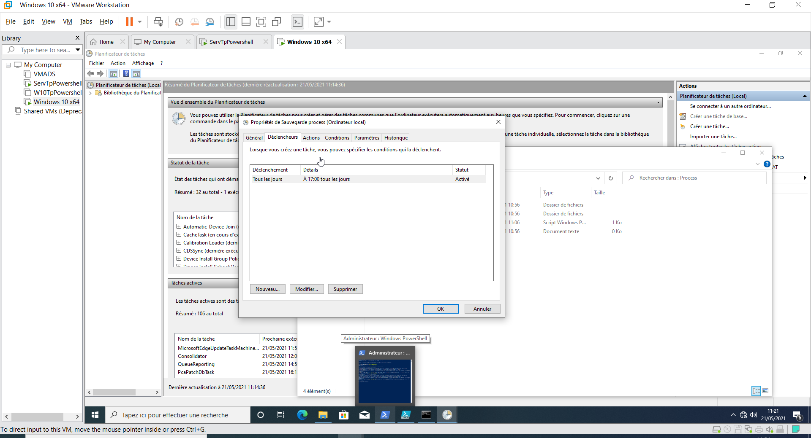
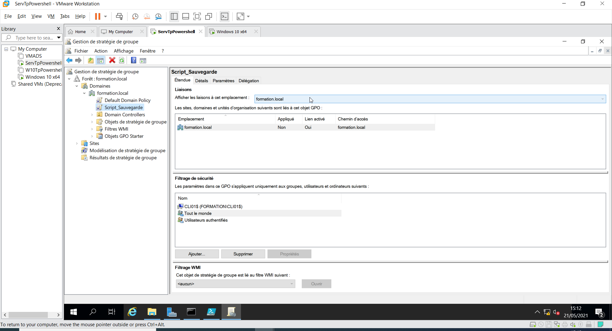

# Prémabules pour les TP suivants:

1 windows server 2019 
1 windows 10 PRO dit "client"

Config windows server 2019:

hostname: SERVEUR

| Reseau        |               |
| ------------- |:-------------:|
| ipv4          | 192.168.1.11  |
| masque        | 255.255.255.0 |
| passerelle    | 192.168.1.10  |
| DNS           | 127.0.0.1     |

1 compte utilisateur et 1 administrateur.
L'ADDS est installé et configuré (forêt formation.local).

Configuration windows 10 PRO:

hostname: cli01

| Reseau        |               |
| ------------- |:-------------:|
| ipv4          | 192.168.1.12  |
| masque        | 255.255.255.0 |
| passerelle    | 192.168.1.10  |
| DNS           | 192.168.1.11  |

1 compte utilisateur et 1 administrateur.

Le poste communique bien avec SERVEUR et vice-versa.
Le poste est connecté à formation.local.

## TP01

Le script `utilisateurs.ps1` créé doit être éxecuté via powershell.
Il demande d'abord le nombre de comptes à créer et dans quel groupe ils vont être incorporés.
Il créé alors le groupe.
L'utilisateur devra ensuite entrer les informations de chaque utilisateur.
Les utilisateurs sont ajoutés au fur et à mesure.
Les informations sont ensuite exportées au format csv.

Il est possible d'améliorer grandement l'utilisation du script en faisant plusieurs choses:

* Un test si le groupe existe déjà (actuellement si il existe déjà il affiche une erreur).
* Un test si le nouvel utilisateur existe déjà (actuellement si il existe une erreur est retournée et le script continue comme si de rien était).
* Un test pour le mot de passe (actuellement si le mot de passe ne respecte pas les exigences de complexités le script affiche une erreur et continue).
* L'adresse mail n'est pas bien utilisée.

## TP02

Le script `save.ps1` doit être éxecuté depuis powershell.
Il sauvegarde les process en cours dans un fichier txt avant de le copier dans un dossier partagé.
Le dossier à partager se trouve dans `C:\Sauvegarde\Process\` et est paramétré pour pouvoir être lu si la requête se trouve dans le même réseau. La machine cli01 à été ajoutée aux exceptions depuis les propriétés.

## TP03

Dans le planificateur de tâches on créé une tâche récursive qui déclenche tous les jours à 17h qui lance une instance de powershell avec comme argument le script de sauvegarde.

Ainsi, tous les jours à 17h, notre script est éxecuté et la sauvegarde effectuée.

## TP04

Dans la machine SERVEUR on créé dans la gestion de stratégie de groupe une nouvelle tâche planifiée dans la forêt formation.local qui s'execute tous les jours à 17h.

Tâche qui éxécute powershell avec comme argument le script déjà créé.

On vérifie bien que la stratégie s'effectue bien sur formation.local, sur les utilisateurs et machines connectées au domaine.

